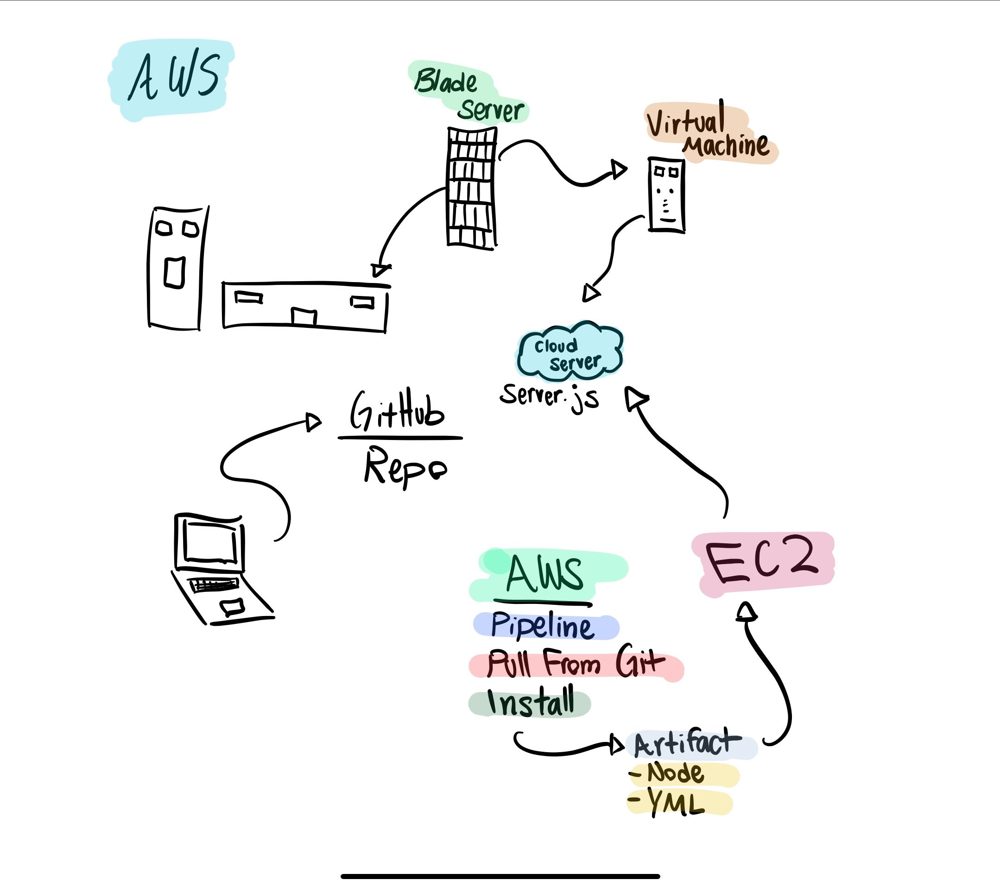

# LAB 19 - Socket.io - Message Queue Server

## Project Name
Socket.io - Message Queue Server

### Author: Brad Smialek

### Links and Resources
* [submission PR](https://github.com/brad-smialek-401-advanced-javascript/class-lab-19-message-queue-server)
* [AWS](http://socketserver-env.2ixrzi57cy.us-east-2.elasticbeanstalk.com/) 

### Modules
#### `app.js`
#### `server.js`
#### `console.js`
#### `theword.js`

#### Running the app
* `node app.js`
  * can talk through terminal
* `node console.js`
  * console logs string 'and no body cares' 
  

#### UML

